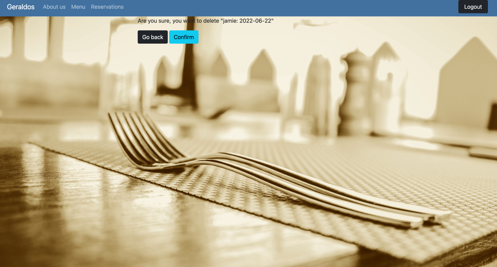
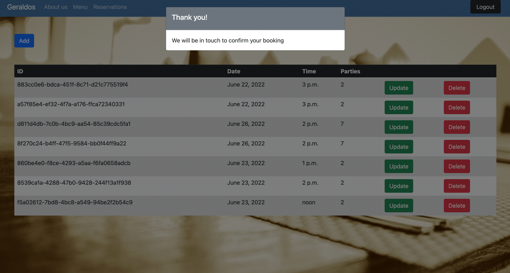

# Geraldos Italian

## Welcome - [Geraldos](https://github.com/jamitag/portfolio-4-restaurant--booking)
The home of authentic Italian cuisine. This site is designed for users to make reservation enquiries for the restaurant. Users will sign up and create an account allowing them to also update or delete any existing reservations.

## How it works

User is greeted with the homepage of the restaurant site. There is five clickable links; Home/About us/Menu/Reservation/Login. If they wish to make a reservation in the restaurant, they should click the ‘Reservation’ link in the nav bar. This will direct them to a Sign In page where they will be prompted to sign in or sign up. Once account is created they will be able to enquire about a reservation for the restaurant and edit it accordingly. Whenever they login in future all existing bookings can be viewed and edited.

## Features

### Existing Features

__Navigation Bar__

The Navigation bar appears at the top of all pages maintaining a consistent look across the website. 
It contains links to a specific areas of the site i.e.

Functionality within includes working links, directing the user to the page they click on. Clicking on the reservations tab, when not logged in, will direct the user to the login page where they can login or create an account.

__Create reservation__

Users can create a reservation for up to 6 people and will receive on screen confirmation that their reservation request has been received.

__View reservation__

Users can view a list of reservations linked to their account within the reservations link in the nav bar. Superusers, using the admin panel can view all existing reservations from all accounts.

__Update reservation__

Users can view a list of reservations linked to their account and make any updates as necessary.

__Delete reservation__

Users can delete any reservations linked to their account and will be prompted to confirm deletion before record is deleted.

__About us__

Users can view the ‘About us’ page which gives some information on our history and values. Inspired by the ‘About us’ page, users can click the ‘Join us’ button to make a reservation.

__Menu__

Users can view our menu. This page has no functionality built in and is for information purposes only.

__User notification__

Once a user has successfully enquired about their booking, they will recieve onscreen confirmation.

### Features to add

- Create a more friendly interface for the superuser to view and manage reservations.

- Create user commands to display useful information such as filtering number of reservations between a certain date or time.

- Automate a list of reservations to each staff member on a daily basis for that days covers.

- Add a comments box when creating a reservation to allow customers to input additional information relevant to their booking.

- Send an email confirmation to customers when they make a reservation to give assurance of a successful booking.

- Include more time options in the time field on the reservation form.

## User Experience (UX)

| User Story: Create login | 
| ---- | 
| **Site User** |
| I want to be able to register for an account and view all my reservations. |
| I want to be able to easily login in order to access my reservations. |
| I want to be able to easily logout to protect my information. |
| I want to be able to easily login in order to access my reservations. |
| I want to be able to easily login in order to access my reservations. |
| **Site Owner** |
| I want customers to register an account with us as a way to remain engaged with the restaurant |

| User Story: Create reservation | 
| ---- | 
| **Site User** |
| I want to be able make an online reservation. |
| I want to only input data relevant for my reservation. |
| I want my reservation to be accessible in order to view at a later date. |
| **Site Owner** |
| I want to to offer an online reservation option to customers to offer the customers an additional, easier method of making a reservations - as opposed to calling the restaurant. |

| User Story: View reservations | 
| ---- | 
| **Site User** |
| I want to be able to view all upcoming as well as previous reservations made. |
| **Site Owner** |
| I want to be able to see a list of reservations made in order to plan each day. |

| User Story: Delete / Amend reservations. | 
| ---- | 
| **Site User** |
| I want to be able to be able to amend my reservation online easily. |
| I want to be able to be able to delete my reservation online easily. |
| **Site Owner** |
| I want to be able to see any updates made to reservations for planning purposes. |

## Data Model

## Testing

### Manual Testing

| Test | Expectation | Working |
| ---- | ------ | --------------- |
| Click ‘Geraldos’ in Navbar| Take user to homepage | YES |
| Click ‘About us’ in Navbar| Take user to about us section | YES |
| Click ‘Menu’ in Navbar| Take user to menu section | YES |
| Click ‘Reservation’ in Navbar (When not logged in)| Take user to sign in section | YES |
| Click ‘Reservation’ in Navbar (When logged in)| Take user to reservation list | YES |
| User is limited to number parties in a single reservation | When a figure over 6 is inputed an error message is displayed | YES |
| Current login in state is reflected to the user | Button displays ‘Login’ when user is logged out and displays ‘Logout’ whilst user is logged in | YES |
| Click ‘Login’ in Navbar (When not logged in)| Take user to sign in section | YES |
| Click ‘Logout’ in Navbar (When logged in)| Logs user out and directs to homepage| YES |
| Click ‘Login’ in Navbar (When not logged in)| Take user to sign in section | YES |
| Click ‘Come Join us’ in ‘About us’ section (When not logged in)| Take user to sign in section | YES |
| Click ‘Come Join us’ in ‘About us’ section (When logged in)| Take user to reservation list | YES |
| Click ‘Sign up’ in ‘Login’ section | Take user to “Sign up’ section to register of an account | YES |
| Click ‘Already have an account’ in ‘Sign up’ section | Returns user to Login page | YES |
| User successfully logs in | Redirects to homepage | YES |
| Click Update on existing reservation | Take user to ‘update reservation’ form | YES |
| Click Delete on existing reservation | User is asked to confirm they want to delete | YES |
| Confirming Delete reservation | Reservation is removed from users list of reservations | YES |
| Clicking Add reservation | Take user to the reservation form | YES |
| Submitting reservation | User is notified on screen that their reservation request has been successful | YES |
| Removing on screen modal after submitting reservation | Clicking anywhere outside of modal will remove it and display the updated reservation list | YES |
| Login into admin section | Using a superuser login I can gain access to the admin panel | YES |
| Viewing all reservations | Within admin panel I can see a list of all reservations that have been made by all users | YES |

### Validator Testing

#### Python

I fixed the basic errors from the Problems tab in the terminal using flake8. Additionally, all .py files were ran through <a href="http://pep8online.com">PEP8 linter</a>. Common errors encountered such as ‘Line too long’, ‘Trailing white space’, ‘Black lines’ etc where found. Most where tidied up without any concerns - see issues below for outstanding issue.

#### HTML

I had to open HTML page in the browser and copy the rendered HTML code into the validator in order to avoid errors caused by the Django expressions when simply pasting my template code into the validator.
All HTML code was run through [W3C HTML validation service](https://validator.w3.org/nu/). All errors found where cleared without any concerns.

#### CSS

My CSS code contained within base.html was ran through [W3C CSS validation service](https://jigsaw.w3.org/css-validator/) and showed no errors.

#### JavaScript

The small portion of JS used was validated with [JSHint validator](media/jshint.png) and no errors where found.

### Responsiveness

The site was tested across several devices with varying screen sizes;

- MacBook - 1280 x 1200
- iPad	- 768 x 1024
- iPhone 6/7/8 - 375 x 667

## Bugs

Error - Continuous application error from Heroku when deploying, despite following the django cheat sheet steps many times.

Solution - Within the build log there was an error relating to the presence of bootstrap4 whilst the project was using bootstrap5. All mentions of bootstrap4 where removed from the project and it deployed without issue.

Error - I faced a further Heroku issue when I removed the ‘DISABLE_COLLECTSTATIC’ config var. This prevented my CSS file, contained in my static folder, from linking to Heroku - disabling all stying contained within. 

Solution - No resolution was found after consulting both my mentor and the slack community. To overcome this, I decided to leave the config var in place and remove my need for a CSS file by utilising inline styling and including style tags at the bottom of my base.html for media queries. This clearly isn’t an ideal solution and didn’t solve the initial problem, but this issue arose days before submission and I didn’t have time to investigate thoroughly. In future I will be aware and look out for this issue early on in any projects. 

Error - I was receiving several E501 errors - ‘Line too long’ the running my settings.py file through PEP8. I could not format in a correct manner which removed the error and allowed the code to function.

Solution - Appending the relevant line with ‘# noqa: E501’ disables the error when run through pep8.

Error - The method used to dynamically display my images, noted in the credits section below, did not work when applied to my background image.

Solution - Considerable time was spent on this and no solution could be found. My deployed project will contain no background image This does not adversely affect website or the functionality of the booking system but it does look a bit plain, unfortunately.

Error - I was trying to store the date and time as one field but allow the user to enter each field separately.

Solution - I discovered that django offered separate date and time fields.

Error - I was unsuccsessfully trying to link the contact model to the reservation and user models in order to link reservations to a user but this resulted in all reservations displaying for all users.

Solution - Updating the user field to a 'foreign key' instead of a 'text field' provided a relationship between the reserve modal and the user modal, linking each reservation the correct user.

Error - Within the reservation form, I could not set my time field to 30 minute intervals - only hourly.

Solution - No solution could be found. the reservation form continues to only offer on the hour enquiries during opening times.

## Technologies

### Editor
- GitPod

### Languages
- Pyhthon
- HTML5
- CSS3 / bootstrap
- JavaScript

### Template
- Django

### Database
- PostgreSQL

### Version control
- GitHub

### Libraries
- Google Fonts
- Stock Images

### Other
- Image resizing - [reduceimages.com](https://www.reduceimages.com/)
- Cloudinary
- [Drawsql](https://drawsql.app/home)

## Deployment

This programme was deployed using [Heroku](https://heroku.com/)

1. Log into Heroku, select 'Create new app’.
2. Name your application then within the the dashboard, select settings and scroll down to ‘Reveal Config vars’
3. Enter relevant config vars, remembering to include any environmental variables you have in place.
4. Go to Resources, Add-ons and search for PostgreSQL
5. Navigate from ‘Settings’ to ‘Deploy’ and select ‘Github’ within the ‘Deployment Method’ section.
6. Search and connect your Github repo in the ‘Connect to Github’ section.
7. Clicking ‘Deploy branch’ will then create your Heroku app and you can view it by clicking the ‘View’ button at the bottom of the page.
	- Selecting ‘Enable Automatic Deploys’ will ensure that your Heroku app is updated each time you push changes from Gitpod otherwise you will have to deploy manually each time using the steps mentioned above.

A comprehensive view of how I set up and deployed my project can be found in this [guide](https://codeinstitute.s3.amazonaws.com/fst/Django%20Blog%20Cheat%20Sheet%20v1.pdf), provided by Code Institute.

## Credits

### Content

Discovering the [Max value validator](https://www.reddit.com/r/django/comments/2q5u0p/way_to_make_a_min_and_max_values_restriction_on_a/%20-%20for%20limiting%20number%20of%20people%20m%20making%20reservations) allowed me restrict the number of parties to a maximum of 6 for a single reservation.

[Block title](https://stackoverflow.com/questions/66172337/django-block-page-title) was used to add different titles to every page of the site.

[This](https://www.youtube.com/watch?v=1T6G7Znrbfg) YouTube resource was used to help show the site images via Cloudinary.

[This](https://www.youtube.com/watch?v=jp_p6wCkc9I) YouTube resource was used to help create the modal used to display to the user they have made a successful submission for a reservation.

The trick to overcome the E501 error issue can be found [here](https://stackoverflow.com/questions/47876079/how-to-tell-flake8-to-ignore-comments).

Other resources I found incredibly helpful where a series of Django tutorials from [Corey Schafer](https://www.youtube.com/watch?v=UmljXZIypDc&list=PL-osiE80TeTtoQCKZ03TU5fNfx2UY6U4p), [Mosh](https://www.youtube.com/watch?v=_uQrJ0TkZlc), and [Net Ninja](https://www.youtube.com/watch?v=n-FTlQ7Djqc&list=PL4cUxeGkcC9ib4HsrXEYpQnTOTZE1x0uc).

The menu for my site was obtained from a local italian restaurant near me; [Fabios](https://fabios-restaurant.com/wp-content/uploads/2017/11/LunchMenu.pdf)

### Other

Thank you to Sandeep, my mentor, for providing assistance throughout this project and discovering my deployment bug in about 10 seconds despite spending weeks trying myself. Thank you also to my friend and boss, Naresh for giving me time away to finalise and submit my project.
